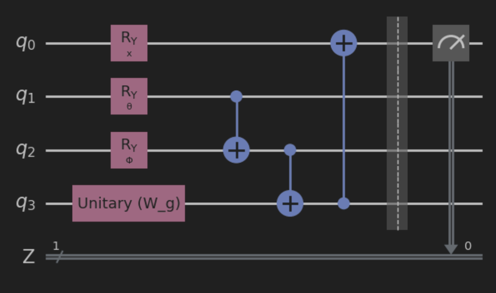

# Hybrid Quantum-Classical Self-Attention

Quantum Self-Attention Variational Circuit:

### References

[1] Classical Self-Attention Mechanism from paper (Fig. 2): https://arxiv.org/pdf/1711.07971.pdf

