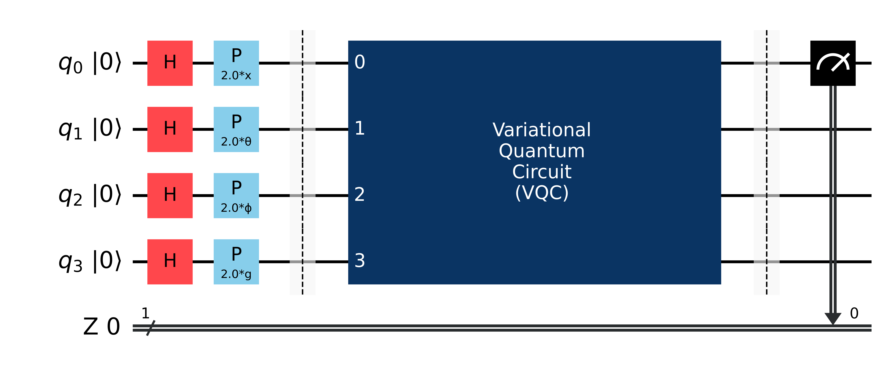

# Hybrid Quantum-Classical Self-Attention

### Quantum Self-Attention Variational Circuit

(Designed using Qiskit)

The visual barriers divide the circuit used in the model into 3 respective parts: Encoder, Parametrized Quantum Circuit, Measurement.

**Encoder:** The classical data is encoded using [ZFeatureMap](https://qiskit.org/documentation/stubs/qiskit.circuit.library.ZFeatureMap.html).

**Parametrized Quantum Circuit:** This is the Quantum Self-Attention circuit which is parametrized.

**Measurement:** The quantum circuit is measured at one qubit (qubit 0).

### Model

[TODO - Explain]

### References

[1] Classical Self-Attention Mechanism from paper (Fig. 2): https://arxiv.org/pdf/1711.07971.pdf

