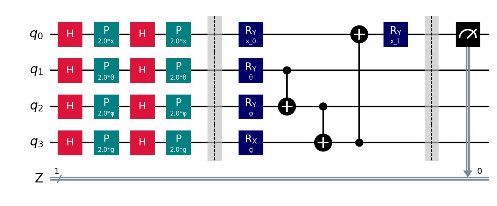

# Quantum Self-Attention

### Quantum Self-Attention Circuit

(Designed using Qiskit)

The visual barriers divide the circuit used in the model into 3 respective parts: 
Encoder, Parametrized Quantum Circuit, and Measurement.

**Encoder:** The classical data is encoded using either the ZFeatureMap.

**Parametrized Quantum Circuit:** This is the Quantum Self-Attention circuit 
which is parametrized.

**Measurement:** The quantum circuit is measured at one qubit (qubit 0).

### Quantum Self-Attention Neural Network

The Quantum Self-Attention Neural Network (Quan-SANN) is composed of the 
[ZFeatureMap](https://qiskit.org/documentation/stubs/qiskit.circuit.library.ZFeatureMap.html) 
to encode data and the Quantum Self-Attention circuit to perform computation.

Then, a neural network implementation based on the Estimator primitive, 
[EstimatorQNN](https://qiskit.org/ecosystem/machine-learning/stubs/qiskit_machine_learning.neural_networks.EstimatorQNN.html), 
for binary-class models or the Sampler primitive, 
[SamplerQNN](https://qiskit.org/ecosystem/machine-learning/stubs/qiskit_machine_learning.neural_networks.SamplerQNN.html), 
for multi-class models, is used to take in our parametrized Quantum Self-Attention circuit with our weight parameters, 
combined with our feature map and its input parameters.

The output of this quantum neural network is then mapped to the output classes using a custom interpret function.

### Model (Hybrid CNN-Quan-SANN)

The model utilizes a Hybrid Quantum-Classical approach by utilizing classical CNN to extract features 
and then pass those features to our Quantum Self-Attention module. 

### References

[1] Classical Self-Attention Mechanism from (Fig. 2) of paper: https://arxiv.org/pdf/1711.07971.pdf

